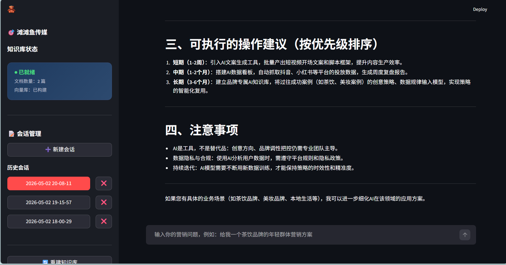
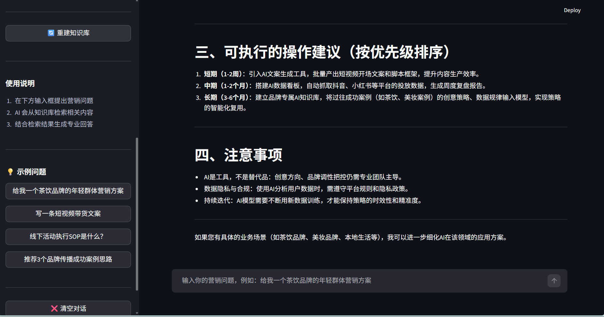
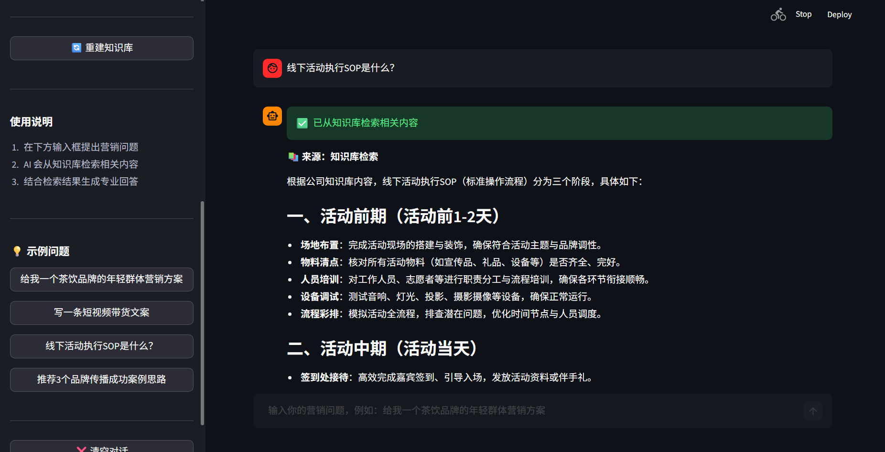
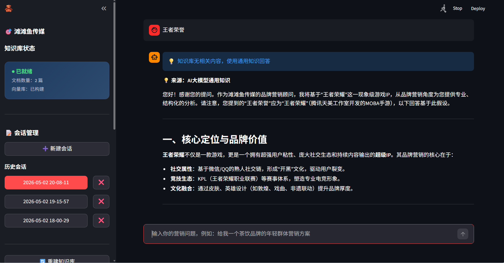
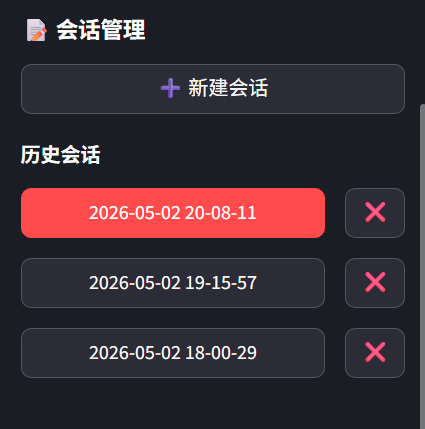
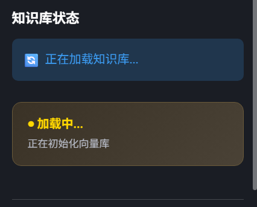

# 传媒行业RAG知识库系统

基于RAG（检索增强生成）技术构建的传媒行业专用知识库系统，支持智能问答、会话管理、文档检索等功能，专为国内网络环境优化，开箱即用。

---

## 📋 目录

- [项目简介](#-项目简介)
- [界面效果图](#-界面效果图)
- [核心功能](#-核心功能)
- [快速开始](#-快速开始)
- [项目结构](#-项目结构)
- [知识库说明](#-知识库说明)
- [常见问题](#-常见问题)
- [注意事项](#-注意事项)
- [许可证](#-许可证)
- [联系方式](#-联系方式)

---

## 📖 项目简介

**传媒行业RAG知识库系统**是一个面向传媒从业者的智能知识管理平台，旨在解决传媒行业知识碎片化、检索效率低、学习成本高等痛点问题。

### 核心价值

- **提升工作效率**：通过智能问答快速定位所需知识，减少信息检索时间
- **精准知识检索**：基于RAG技术实现语义级匹配，避免关键词搜索的局限性
- **降低学习成本**：结构化知识库+示例问题引导，新手也能快速上手
- **国内网络适配**：集成HuggingFace国内镜像，本地Embedding模型，无需科学上网

### 应用场景

系统预置5类传媒行业核心知识库：
- 📱 新媒体运营策略与技巧
- 🔥 公关危机处理流程与案例
- 🎬 短视频创作方法论
- 🤝 KOL/KOC合作规范与案例
- 🎯 线下活动策划执行指南

---

## 🖼️ 界面效果图

> **提示**：以下效果图展示系统核心界面。

### 1. 主聊天界面




**界面说明**：
- 暗色主题设计，护眼舒适
- 左侧会话管理面板（新建、切换、删除会话）
- 右侧聊天区域（用户提问 + AI回答）
- 顶部显示知识库状态（就绪/加载中）
- 底部输入框支持多轮对话

---

### 2. 知识库检索问答演示

### RAG库检索到数据

### RAG库未检索到数据调用大模型回答


**界面说明**：
- 用户提问："新媒体运营如何提升粉丝互动率？"
- AI回答展示（基于RAG检索结果生成）
- RAG模式标识（🔍 已匹配知识库内容）
- 引用来源标注（显示匹配的文档片段）
- 直连模式标识（⚡ 无匹配时使用LLM兜底）

---

### 3. 会话管理界面



**界面说明**：
- ➕ 新建会话按钮（创建独立聊天上下文）
- 📂 历史会话列表（按时间排序，显示最后一条消息预览）
- 🔄 会话切换（点击即可加载历史对话）
- 🗑️ 删除会话（支持单个删除，防止误操作二次确认）
- 💾 自动保存（每条消息实时持久化到本地JSON文件）

---

### 4. 知识库状态与示例问题



**界面说明**：
- ✅ 知识库就绪状态指示器（绿色=就绪，黄色=加载中，红色=异常）
- 📊 知识库统计信息（文档数量、分片数量、向量维度）
- ❓ 示例问题列表（点击即可快速提问，降低使用门槛）
- 📁 知识库文档列表（显示已上传的文件名和类型）
- ⚙️ 配置信息展示（当前使用的Embedding模型、向量库路径）

---

## ✨ 核心功能

### 1. 传媒行业知识库管理
- 支持上传、存储、检索5类传媒专用知识库文档
- 自动文本分片与向量化，适配RAG检索需求
- 支持 `.txt`、`.md` 格式文档
- 实时更新知识库，无需重启服务

### 2. 智能问答（RAG + LLM双模式）
- **RAG模式**：优先从知识库检索相关内容，生成精准回答
- **直连模式**：当知识库无匹配内容时，自动切换至LLM直接生成
- 智能路由机制，根据置信度自动选择最佳回答策略
- 显示回答来源标识，提升透明度与可信度

### 3. 会话持久化管理
- 自动保存聊天记录至本地JSON文件
- 支持新建会话（独立上下文）
- 支持历史会话切换（无缝恢复对话）
- 支持删除会话（清理无用记录）
- 会话数据隔离，互不干扰

### 4. 国内网络环境适配
- 集成HuggingFace国内镜像源（hf-mirror.com）
- 支持本地Embedding模型（bge-small-zh-v1.5）
- 无需科学上网即可正常运行
- 首次启动自动下载模型（约400MB）

### 5. 简洁可视化界面
- Streamlit构建的现代化Web界面
- 暗色主题设计，长时间使用不疲劳
- 响应式布局，适配不同屏幕尺寸
- 操作直观，新手零学习成本

### 6. 数据复盘与统计
- 查看聊天历史记录
- 展示检索匹配度（相似度分数）
- 统计会话数量、消息条数
- 导出聊天记录（可选功能）

---

## 🚀 快速开始

### 环境准备

**系统要求**：
- Python 3.10 或更高版本
- Windows / macOS / Linux 操作系统
- 至少4GB可用内存（推荐8GB）

**安装依赖**：
bash pip install -r requirements.txt

**关键配置说明**：
- `OPENAI_API_KEY`：如需使用OpenAI GPT模型，填写API Key
- `DEEPSEEK_API_KEY`：推荐使用DeepSeek，性价比更高
- `CHROMA_DB_PATH`：向量数据库存储路径，建议放在D盘等非系统盘
- `EMBEDDING_MODEL_NAME`：中文场景推荐使用 `bge-small-zh-v1.5`

### 启动项目

启动成功后，浏览器会自动打开 `http://localhost:8501`

### 基础使用教程

#### Step 1: 上传知识库文档

1. 将传媒行业文档放入 `media_docs/` 文件夹
2. 支持的格式：`.txt`、`.md`
3. 建议文档结构清晰，分段明确（便于分片检索）
4. 刷新页面，系统自动加载新文档

#### Step 2: 开始提问

1. 在底部输入框输入问题
2. 按 `Enter` 键或点击发送按钮
3. 等待AI回答（RAG模式通常3-5秒，直连模式5-10秒）
4. 查看回答来源标识（🔍=RAG检索，⚡=LLM直连）

#### Step 3: 管理会话

- **新建会话**：点击左侧 ➕ 按钮
- **切换会话**：点击历史会话条目
- **删除会话**：点击会话旁的 🗑️ 图标（需二次确认）
- **导出记录**：右键会话可选择导出为TXT文件（可选功能）

#### Step 4: 查看示例问题

点击右侧示例问题列表中的问题，快速体验系统能力：
- "新媒体运营如何提升粉丝互动率？"
- "公关危机处理的黄金24小时原则是什么？"
- "短视频脚本创作的3秒法则如何应用？"

---

## 📁 项目结构
# 项目结构

```text
品牌营销智能助手/
├── main.py              # 主入口文件，Streamlit 应用启动逻辑
├── config.py            # 配置文件（API Key、模型路径、数据库配置等）
├── rag_chain.py          # RAG 核心逻辑（检索链、生成链、智能路由）
├── loader.py             # 文档加载器（读取、分片、向量化）
├── ui.py                 # UI 组件封装（聊天界面、侧边栏、状态指示器）
├── utils.py              # 工具函数（会话管理、日志记录、错误处理）
│
├── media_docs/           # 【知识库目录】存放传媒行业文档
│   ├── media.docx       # 示例文档1
│   └── media01.docx     # 示例文档2
│
├── assets/              # 【资源文件】效果图、图标等
│   ├── logo.png
│   ├── main_chat_interface.png
│   ├── rag_qa_demo.png
│   └── session_management.png
│
├── .gitignore            # Git 忽略规则（敏感文件、缓存、模型、数据库）
├── requirements.txt      # Python 依赖包列表
└── README.md             # 项目说明文档


---
**核心文件职责说明**：

| 文件名 | 核心职责 |
|--------|---------|
| `main.py` | Streamlit应用入口，整合UI、RAG链、会话管理 |
| `config.py` | 集中管理所有配置项，方便统一修改 |
| `rag_chain.py` | RAG检索链、生成链、智能路由逻辑 |
| `loader.py` | 文档加载、文本分片、向量化入库 |
| `ui.py` | Streamlit UI组件封装（聊天窗口、侧边栏等） |
| `utils.py` | 通用工具函数（JSON读写、日志、异常处理） |


## 📚 知识库说明

### 预置知识库内容

项目配套5份传媒行业核心知识库文档：

1. **新媒体运营** (`new_media_operations.txt`)
   - 平台运营策略（微信、微博、抖音、小红书）
   - 内容创作方法论
   - 粉丝增长与互动技巧
   - 数据分析与优化

2. **公关危机处理** (`pr_crisis_management.txt`)
   - 危机预警机制
   - 黄金24小时应对流程
   - 舆情监测与分析
   - 经典案例复盘

3. **短视频创作** (`short_video_creation.txt`)
   - 脚本创作技巧（3秒法则、黄金结构）
   - 拍摄与剪辑要点
   - 爆款视频拆解
   - 平台算法解析

4. **KOL/KOC合作** (`kol_koc_cooperation.txt`)
   - 达人筛选标准
   - 合作模式与报价
   - 效果评估指标
   - 合同注意事项

5. **线下活动策划** (`offline_event_planning.txt`)
   - 活动类型与策划流程
   - 预算管理与成本控制
   - 执行细节与风险预案
   - 效果评估与复盘

### 知识库结构特点

- **结构化文本**：采用清晰的标题层级（#、##、###），便于分片
- **语义完整性**：每个分片保持完整语义，避免断章取义
- **适配RAG检索**：分片长度控制在300-500字，平衡检索精度与上下文长度

### 如何添加/修改/删除知识库文档

#### 添加文档

1. 将新文档放入 `media_docs/` 文件夹
2. 确保文件格式为 `.txt` 或 `.md`
3. 刷新网页，系统自动检测并加载新文档
4. 查看控制台日志确认加载成功

#### 修改文档

1. 直接编辑 `media_docs/` 中的文件
2. 删除 `chroma_db/` 文件夹（清空向量库）
3. 重启服务，系统重新加载所有文档

#### 删除文档

1. 从 `media_docs/` 文件夹中删除对应文件
2. 删除 `chroma_db/` 文件夹
3. 重启服务，系统重新加载剩余文档

> **注意**：修改或删除文档后，必须清空 `chroma_db/` 并重启，否则会出现数据不一致

---

